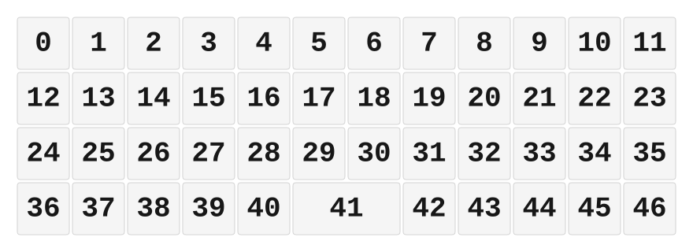
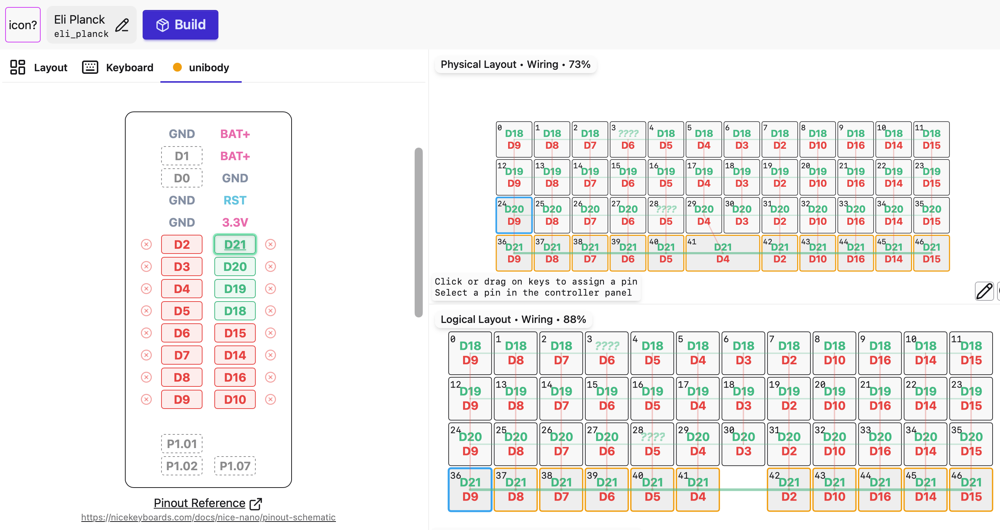

# ZMK Configuration for Eli Planck

*Generated by Shield Wizard for ZMK*



Download compiled firmware from the Actions tab. <https://zmk.dev/docs/user-setup#installing-the-firmware>

Edit your keymap <https://zmk.dev/docs/keymaps>.
User keymap is located at [`config/eli_planck.keymap`](config/eli_planck.keymap).

Firmware built with <https://shield-wizard.genteure.workers.dev>


-----

<details>
<summary>
Shield Wizard Debug Information
</summary>

In case of broken configuration, here is the Shield Wizard internal data used to generate this configuration:

Commit: 5840d41ac0915092c8fe45da617ffb4bb91e1b97

```json
{"name":"Eli Planck","shield":"eli_planck","dongle":false,"modules":[],"layout":[{"id":"01KQ9ZP2KDBRBFHQB67QQXC0AK","part":0,"row":0,"col":0,"w":1,"h":1,"x":0,"y":0,"r":0,"rx":0,"ry":0},{"id":"01KQ9ZP2KDAAKDTGZJQ0QPPC81","part":0,"row":0,"col":1,"w":1,"h":1,"x":1,"y":0,"r":0,"rx":0,"ry":0},{"id":"01KQ9ZP2KD77PGP7B0MQH3JW8W","part":0,"row":0,"col":2,"w":1,"h":1,"x":2,"y":0,"r":0,"rx":0,"ry":0},{"id":"01KQ9ZP2KDJ2BQRTP4SM8FS6XH","part":0,"row":0,"col":3,"w":1,"h":1,"x":3,"y":0,"r":0,"rx":0,"ry":0},{"id":"01KQ9ZP2KDHBQ6DGDG1D8E88KD","part":0,"row":0,"col":4,"w":1,"h":1,"x":4,"y":0,"r":0,"rx":0,"ry":0},{"id":"01KQ9ZP2KD7RTAC6FP6S65P0N9","part":0,"row":0,"col":5,"w":1,"h":1,"x":5,"y":0,"r":0,"rx":0,"ry":0},{"id":"01KQ9ZP2KDPMTMNJJC4JPYNS84","part":0,"row":0,"col":6,"w":1,"h":1,"x":6,"y":0,"r":0,"rx":0,"ry":0},{"id":"01KQ9ZP2KDPNWCF1JBY6B898FJ","part":0,"row":0,"col":7,"w":1,"h":1,"x":7,"y":0,"r":0,"rx":0,"ry":0},{"id":"01KQ9ZP2KDFDNBW2YVMC62XYMX","part":0,"row":0,"col":8,"w":1,"h":1,"x":8,"y":0,"r":0,"rx":0,"ry":0},{"id":"01KQ9ZP2KDFXH3AVPDM4KM75JD","part":0,"row":0,"col":9,"w":1,"h":1,"x":9,"y":0,"r":0,"rx":0,"ry":0},{"id":"01KQ9ZP2KDFVABTBX11G4D7JF2","part":0,"row":0,"col":10,"w":1,"h":1,"x":10,"y":0,"r":0,"rx":0,"ry":0},{"id":"01KQ9ZP2KDAXQN3RDYSTVK481E","part":0,"row":0,"col":11,"w":1,"h":1,"x":11,"y":0,"r":0,"rx":0,"ry":0},{"id":"01KQ9ZP2KDFH867SAR853NDY4X","part":0,"row":1,"col":0,"w":1,"h":1,"x":0,"y":1,"r":0,"rx":0,"ry":0},{"id":"01KQ9ZP2KDD826XWHR257JDXDT","part":0,"row":1,"col":1,"w":1,"h":1,"x":1,"y":1,"r":0,"rx":0,"ry":0},{"id":"01KQ9ZP2KDW4XSKSDX6WVTM847","part":0,"row":1,"col":2,"w":1,"h":1,"x":2,"y":1,"r":0,"rx":0,"ry":0},{"id":"01KQ9ZP2KDJ6M4D12D4515VYMH","part":0,"row":1,"col":3,"w":1,"h":1,"x":3,"y":1,"r":0,"rx":0,"ry":0},{"id":"01KQ9ZP2KDPHEKNBDKH7H5B7PM","part":0,"row":1,"col":4,"w":1,"h":1,"x":4,"y":1,"r":0,"rx":0,"ry":0},{"id":"01KQ9ZP2KDQW6YGW01XZAMTSCD","part":0,"row":1,"col":5,"w":1,"h":1,"x":5,"y":1,"r":0,"rx":0,"ry":0},{"id":"01KQ9ZP2KD5180WTJXMXC5F6D8","part":0,"row":1,"col":6,"w":1,"h":1,"x":6,"y":1,"r":0,"rx":0,"ry":0},{"id":"01KQ9ZP2KDQGPP2QZCJD15RK6J","part":0,"row":1,"col":7,"w":1,"h":1,"x":7,"y":1,"r":0,"rx":0,"ry":0},{"id":"01KQ9ZP2KDHPD0V0V1QAHGD3M6","part":0,"row":1,"col":8,"w":1,"h":1,"x":8,"y":1,"r":0,"rx":0,"ry":0},{"id":"01KQ9ZP2KDXGPVJZBTANCZX7NP","part":0,"row":1,"col":9,"w":1,"h":1,"x":9,"y":1,"r":0,"rx":0,"ry":0},{"id":"01KQ9ZP2KD26WXRS88RJD9S4D7","part":0,"row":1,"col":10,"w":1,"h":1,"x":10,"y":1,"r":0,"rx":0,"ry":0},{"id":"01KQ9ZP2KDARGN9YQHC7VM475Y","part":0,"row":1,"col":11,"w":1,"h":1,"x":11,"y":1,"r":0,"rx":0,"ry":0},{"id":"01KQ9ZP2KDYM0DNSCWF1DW07B7","part":0,"row":2,"col":0,"w":1,"h":1,"x":0,"y":2,"r":0,"rx":0,"ry":0},{"id":"01KQ9ZP2KDZ9ZGCTYA6QYF781K","part":0,"row":2,"col":1,"w":1,"h":1,"x":1,"y":2,"r":0,"rx":0,"ry":0},{"id":"01KQ9ZP2KDF1GSRSZBDDB4N3BB","part":0,"row":2,"col":2,"w":1,"h":1,"x":2,"y":2,"r":0,"rx":0,"ry":0},{"id":"01KQ9ZP2KDWVNK6Q6SKNZ0JP23","part":0,"row":2,"col":3,"w":1,"h":1,"x":3,"y":2,"r":0,"rx":0,"ry":0},{"id":"01KQ9ZP2KDPSYXFC3J65MJ04V4","part":0,"row":2,"col":4,"w":1,"h":1,"x":4,"y":2,"r":0,"rx":0,"ry":0},{"id":"01KQ9ZP2KDY9T2KN46MYJ0RATT","part":0,"row":2,"col":5,"w":1,"h":1,"x":5,"y":2,"r":0,"rx":0,"ry":0},{"id":"01KQ9ZP2KD4T177WD23HV2P23T","part":0,"row":2,"col":6,"w":1,"h":1,"x":6,"y":2,"r":0,"rx":0,"ry":0},{"id":"01KQ9ZP2KDFFYTYD4F32MW5RMV","part":0,"row":2,"col":7,"w":1,"h":1,"x":7,"y":2,"r":0,"rx":0,"ry":0},{"id":"01KQ9ZP2KDZ1GFBNNZQRMS197P","part":0,"row":2,"col":8,"w":1,"h":1,"x":8,"y":2,"r":0,"rx":0,"ry":0},{"id":"01KQ9ZP2KD97756CFRNCQETZZR","part":0,"row":2,"col":9,"w":1,"h":1,"x":9,"y":2,"r":0,"rx":0,"ry":0},{"id":"01KQ9ZP2KDD4AYKAYG00DX5BA2","part":0,"row":2,"col":10,"w":1,"h":1,"x":10,"y":2,"r":0,"rx":0,"ry":0},{"id":"01KQ9ZP2KD5ZMSKEN55R9NZBT5","part":0,"row":2,"col":11,"w":1,"h":1,"x":11,"y":2,"r":0,"rx":0,"ry":0},{"id":"01KQ9ZP2KDWDTPGMGKNCT6VR91","part":0,"row":3,"col":0,"w":1,"h":1,"x":0,"y":3,"r":0,"rx":0,"ry":0},{"id":"01KQ9ZP2KDQNRN3PFQ1SXMW9NH","part":0,"row":3,"col":1,"w":1,"h":1,"x":1,"y":3,"r":0,"rx":0,"ry":0},{"id":"01KQ9ZP2KD5BH1BV3TJMSB6GZE","part":0,"row":3,"col":2,"w":1,"h":1,"x":2,"y":3,"r":0,"rx":0,"ry":0},{"id":"01KQ9ZP2KD2QKRCBSH8P37SZ08","part":0,"row":3,"col":3,"w":1,"h":1,"x":3,"y":3,"r":0,"rx":0,"ry":0},{"id":"01KQ9ZP2KDSM6FD7CTJETQHE74","part":0,"row":3,"col":4,"w":1,"h":1,"x":4,"y":3,"r":0,"rx":0,"ry":0},{"id":"01KQ9ZP2KDZWPPT6AMZ80STCXC","part":0,"row":3,"col":5,"w":2,"h":1,"x":5,"y":3,"r":0,"rx":0,"ry":0},{"id":"01KQ9ZP2KEP0WJEMEJZM314DKG","part":0,"row":3,"col":7,"w":1,"h":1,"x":7,"y":3,"r":0,"rx":0,"ry":0},{"id":"01KQ9ZP2KE5CCSVE2Y4DZ3FN0Y","part":0,"row":3,"col":8,"w":1,"h":1,"x":8,"y":3,"r":0,"rx":0,"ry":0},{"id":"01KQ9ZP2KEX7VDBVB2YN5PVWS4","part":0,"row":3,"col":9,"w":1,"h":1,"x":9,"y":3,"r":0,"rx":0,"ry":0},{"id":"01KQ9ZP2KE9TX46M9YCXY8KQG7","part":0,"row":3,"col":10,"w":1,"h":1,"x":10,"y":3,"r":0,"rx":0,"ry":0},{"id":"01KQ9ZP2KEG6A6BQ6R2PAXQEHG","part":0,"row":3,"col":11,"w":1,"h":1,"x":11,"y":3,"r":0,"rx":0,"ry":0}],"parts":[{"name":"unibody","controller":"nice_nano_v2","wiring":"matrix_diode","pins":{"d2":"output","d3":"output","d4":"output","d5":"output","d6":"output","d7":"output","d8":"output","d9":"output","d10":"output","d16":"output","d14":"output","d15":"output","d21":"input","d20":"input","d19":"input","d18":"input"},"keys":{"01KQ9ZP2KDBRBFHQB67QQXC0AK":{"input":"d18","output":"d9"},"01KQ9ZP2KDFH867SAR853NDY4X":{"input":"d19","output":"d9"},"01KQ9ZP2KDYM0DNSCWF1DW07B7":{"input":"d20","output":"d9"},"01KQ9ZP2KDWDTPGMGKNCT6VR91":{"input":"d21","output":"d9"},"01KQ9ZP2KDAAKDTGZJQ0QPPC81":{"input":"d18","output":"d8"},"01KQ9ZP2KDD826XWHR257JDXDT":{"input":"d19","output":"d8"},"01KQ9ZP2KDZ9ZGCTYA6QYF781K":{"input":"d20","output":"d8"},"01KQ9ZP2KDQNRN3PFQ1SXMW9NH":{"input":"d21","output":"d8"},"01KQ9ZP2KD77PGP7B0MQH3JW8W":{"input":"d18","output":"d7"},"01KQ9ZP2KDW4XSKSDX6WVTM847":{"input":"d19","output":"d7"},"01KQ9ZP2KDF1GSRSZBDDB4N3BB":{"input":"d20","output":"d7"},"01KQ9ZP2KD5BH1BV3TJMSB6GZE":{"input":"d21","output":"d7"},"01KQ9ZP2KDJ2BQRTP4SM8FS6XH":{"input":"d18","output":"d6"},"01KQ9ZP2KDJ6M4D12D4515VYMH":{"input":"d19","output":"d6"},"01KQ9ZP2KDWVNK6Q6SKNZ0JP23":{"input":"d20","output":"d6"},"01KQ9ZP2KD2QKRCBSH8P37SZ08":{"input":"d21","output":"d6"},"01KQ9ZP2KDHBQ6DGDG1D8E88KD":{"input":"d18","output":"d5"},"01KQ9ZP2KDPHEKNBDKH7H5B7PM":{"input":"d19","output":"d5"},"01KQ9ZP2KDPSYXFC3J65MJ04V4":{"input":"d20","output":"d5"},"01KQ9ZP2KDSM6FD7CTJETQHE74":{"input":"d21","output":"d5"},"01KQ9ZP2KD7RTAC6FP6S65P0N9":{"input":"d18","output":"d4"},"01KQ9ZP2KDQW6YGW01XZAMTSCD":{"input":"d19","output":"d4"},"01KQ9ZP2KDY9T2KN46MYJ0RATT":{"input":"d20","output":"d4"},"01KQ9ZP2KDZWPPT6AMZ80STCXC":{"input":"d21","output":"d4"},"01KQ9ZP2KDPMTMNJJC4JPYNS84":{"input":"d18","output":"d3"},"01KQ9ZP2KD5180WTJXMXC5F6D8":{"input":"d19","output":"d3"},"01KQ9ZP2KD4T177WD23HV2P23T":{"input":"d20","output":"d3"},"01KQ9ZP2KDPNWCF1JBY6B898FJ":{"input":"d18","output":"d2"},"01KQ9ZP2KDQGPP2QZCJD15RK6J":{"input":"d19","output":"d2"},"01KQ9ZP2KDFFYTYD4F32MW5RMV":{"input":"d20","output":"d2"},"01KQ9ZP2KEP0WJEMEJZM314DKG":{"input":"d21","output":"d2"},"01KQ9ZP2KDFDNBW2YVMC62XYMX":{"input":"d18","output":"d10"},"01KQ9ZP2KDHPD0V0V1QAHGD3M6":{"input":"d19","output":"d10"},"01KQ9ZP2KDZ1GFBNNZQRMS197P":{"input":"d20","output":"d10"},"01KQ9ZP2KE5CCSVE2Y4DZ3FN0Y":{"input":"d21","output":"d10"},"01KQ9ZP2KDFXH3AVPDM4KM75JD":{"input":"d18","output":"d16"},"01KQ9ZP2KDXGPVJZBTANCZX7NP":{"input":"d19","output":"d16"},"01KQ9ZP2KD97756CFRNCQETZZR":{"input":"d20","output":"d16"},"01KQ9ZP2KEX7VDBVB2YN5PVWS4":{"input":"d21","output":"d16"},"01KQ9ZP2KDFVABTBX11G4D7JF2":{"input":"d18","output":"d14"},"01KQ9ZP2KD26WXRS88RJD9S4D7":{"input":"d19","output":"d14"},"01KQ9ZP2KDD4AYKAYG00DX5BA2":{"input":"d20","output":"d14"},"01KQ9ZP2KE9TX46M9YCXY8KQG7":{"input":"d21","output":"d14"},"01KQ9ZP2KDAXQN3RDYSTVK481E":{"input":"d18","output":"d15"},"01KQ9ZP2KDARGN9YQHC7VM475Y":{"input":"d19","output":"d15"},"01KQ9ZP2KD5ZMSKEN55R9NZBT5":{"input":"d20","output":"d15"},"01KQ9ZP2KEG6A6BQ6R2PAXQEHG":{"input":"d21","output":"d15"}},"encoders":[],"buses":[{"name":"spi0","devices":[],"type":"spi"},{"name":"spi1","devices":[],"type":"spi"},{"name":"spi2","devices":[],"type":"spi"},{"name":"spi3","devices":[],"type":"spi"},{"name":"i2c0","devices":[],"type":"i2c"},{"name":"i2c1","devices":[],"type":"i2c"}]}]}
```

</details>
